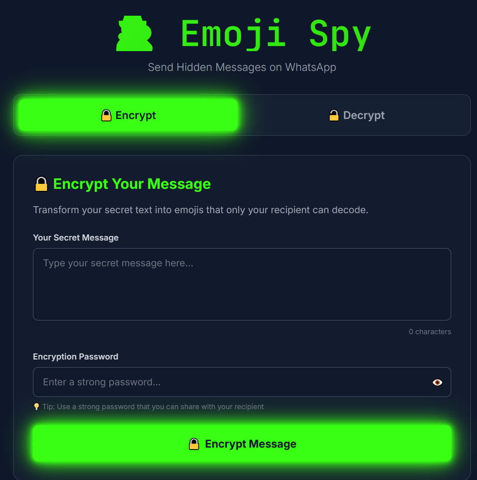

# 🕵️ Emoji Spy - Secure Message Encryption

**Emoji Spy** is a modern, secure, and fun web application that allows you to transform your secret text into a string of emojis. Using military-grade **AES-256 encryption**, it ensures that only you and your intended recipient can read the message.

## 🚀 Live Demo

Check out the live version here: [Emoji Spy Live](https://m-abdullah-2k10.github.io/emoji-encryption/)

---

## ✨ Features

- **🔒 AES-256 Privacy:** Uses industry-standard encryption to keep your messages truly private.
- **😎 Emoji Encoding:** Disguise your encrypted data as fun, casual emojis to bypass filters and hide in plain sight.
- **📱 Share on WhatsApp:** Easily copy or directly share your encrypted emoji messages to WhatsApp.
- **💻 Local Processing:** All encryption and decryption happen in your browser. Your data never touches a server.
- **🎨 Premium UI:** Sleek, neon-glow dark mode interface built with Tailwind CSS.
- **📚 FAQ & Guide:** Built-in instructions and best practices for secure communication.

---

## 📖 How to Use

### Encrypting a Message

1.  Navigate to the **Live Link**: [https://m-abdullah-2k10.github.io/emoji-encryption/](https://m-abdullah-2k10.github.io/emoji-encryption/)
2.  Open the **Encrypt** tab.
3.  Type your secret message in the "Your Secret Message" box.
4.  Enter a strong password.
5.  Click **Encrypt Message**.
6.  Copy the resulting emojis or click **Share** to send them via WhatsApp.

### Decrypting a Message

1.  Open the **Decrypt** tab.
2.  Paste the emoji message you received.
3.  Enter the correct password shared by the sender.
4.  Click **Decrypt Message** to reveal the secret text!

---

## 🛠️ Tech Stack

- **HTML5** - Structure and Semantic Layout
- **Tailwind CSS** - Modern, Responsive Styling & Animations
- **CryptoJS** - Secure AES-256 Encryption Logic
- **JavaScript (ES6+)** - Reactive UI and Encryption Handling
- **Google Fonts** - Inter & JetBrains Mono for a premium look

---

## 🛡️ Privacy & Security

- **Zero Server Storage:** No messages or passwords are saved.
- **Open Source Logic:** Encryption standards are transparent and secure.
- **Randomized Output:** Even with the same password and message, the emoji output changes every time (using Salt & IV) for maximum security.

---

## 📝 License

This project is for educational and personal use. Stay secure! 🔐
